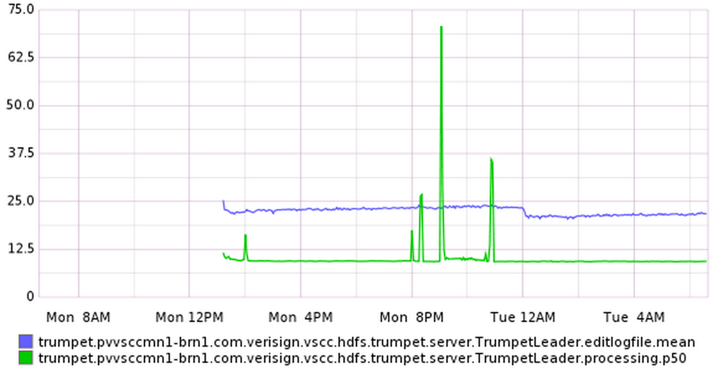
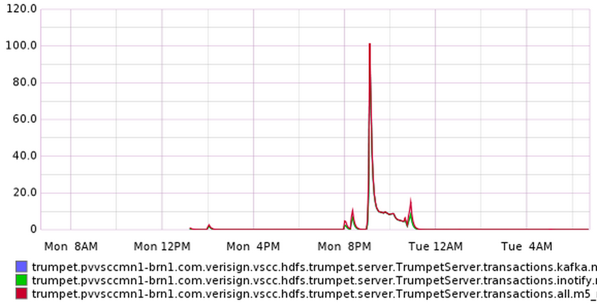

To operate Trumpet on a day-to-day basis, tools are provided to help to understand quickly what's going on in Trumpet. 
And please keep in mind that all the tools are `--help` friendly, so abuse of the help!


## Validate correctness and completeness

A tool is provided which goes back in time as much it can both in the kafka topic and `dfs.*.name.dir` 
and validate that all the transactions in the edit log dir are in Kafka and match:

```
$ /opt/trumpet/server/bin/events-validator.sh --zk.connect <zk_ip:2181> --dfs.edits.dir <root_dir_where_edits_files_are_stored> --numevents 1000000
```


## Peek Kafka topic

At any time, you can peek the Kafka topic, i.e. retrieve and display in a console the _n_ latest messages:

```
$ /opt/trumpet/server/bin/peek-events.sh --zk.connect <zk_ip:2181> --numevents 100
```

If `com.verisign.vscc.hdfs.trumpet.server.tool.PeekInotifyEvents` logger is in debug mode, complete event is dumped into the command line. 
Really useful for debugging, while this might be noisy.


## Workers status

An utility is also provided to display the running Trumpet workers as well as which one is the leader

```
$ /opt/trumpet/server/bin/status.sh --zk.connect <zk_ip:2181>
```


## Kafka Tools

You can also use [plain Kafka tools](https://cwiki.apache.org/confluence/display/KAFKA/System+Tools) to find out 
if there are events flowing into the topic.

### Getting the latest offset

This tool will show you the latest (i.e, most recent) offest of the topic. Calling this function several time will let you show 
how many offset (i.e, inotify events) arrived in the topic:

```
kafka-run-class kafka.tools.GetOffsetShell --broker-list <broker:port> --time -1 --topic hdfs.inotify.events
```


### Peeking Kafka topic

Just like the `peek-events.sh` Trumpet tool, you can display the messages that arrives in the topic because they are plain JSON messages:

```
kafka-simple-consumer-shell --broker-list <broker:port> --topic hdfs.inotify.events --offset -1 --max-messages 5 --partition 0
```


## Graphite Integration

Trumpet relies on the awesome [Metrics library](http://metrics.dropwizard.io/) to collect metrics, 
like the transactionId actually processed, the number of event per seconds
published into Kafka, since when the current daemon is leader, ... 
See the [Metrics](https://github.com/verisign/trumpet/tree/master/server/src/main/java/com/verisign/vscc/hdfs/trumpet/server/metrics/Metrics.java) 
class for more details.

To reports these metrics in [Graphite](http://graphite.wikidot.com/) (or compatible graphite collectors), simply 
run `trumpet.sh` with `--graphite.server.hostport <host>:<port>` and you're all set. `<port>` is optional and is defaulted 
to 2003. `--graphite.prefix` can change the prefix of the metric reported in graphite, by default `trumpet.<hostname>`.

### Graphite samples






## Typical Failure Illustrated

* Trumpet Server #1:

```
2015-06-04 03:11:53.565 DEBUG [Curator-LeaderSelector-0] c.v.v.h.t.s.rx.EditLogObservable - Processed 104 tx and streamed 80 events to the observer. Started at 2154122762 to last decoded txId 2154122865
...
2015-06-04 03:11:54.280 WARN [Curator-LeaderSelector-0] c.v.v.h.trumpet.server.TrumpetLeader - Got exception. Releasing leadership.
```

BAM, died, for whatever reason. Last transaction published is 2154122865

* Trumpet Server #2:

Few milliseconds later, this Trumpet server intance takes over, starting from 2154122866

```
2015-06-04 03:11:54.530 DEBUG [Curator-LeaderSelector-0] c.v.v.h.trumpet.server.TrumpetLeader - Elected as leader, let's stream!
2015-06-04 03:11:54.595 DEBUG [Curator-LeaderSelector-0] c.v.v.h.trumpet.server.TrumpetLeader - Retrieved lastPublishedTxId: 2154122865
2015-06-04 03:11:54.661 DEBUG [Curator-LeaderSelector-0] c.v.v.h.trumpet.server.TrumpetLeader - Reading editLog file /.../dfs/jn/journalhdfs1/current/edits_0000000002154116241-0000000002154123044 from tx 2154122866
```

Running the events-validator, as HDFS, to ensure that not transactions have been lost in between

```
$ /opt/trumpet/server/bin/events-validator.sh --zk.connect ${zkConnect} --numevents 200000 --dfs.edits.dir /.../dfs/jn
Processing /app2/dfs/jn/journalhdfs1/current/edits_0000000002154094680-0000000002154105842 from tx 2154105374
Processing /app2/dfs/jn/journalhdfs1/current/edits_0000000002154105843-0000000002154116240 from tx 2154105843
...
Good, kafka topic hdfs.inotify.events and edit.log.dir com.verisign.vscc.hdfs.trumpet.server.editlog.EditLogDir[/.../dfs/jn/journalhdfs1/current] look consistent.

```

Alright, no transaction lost!

